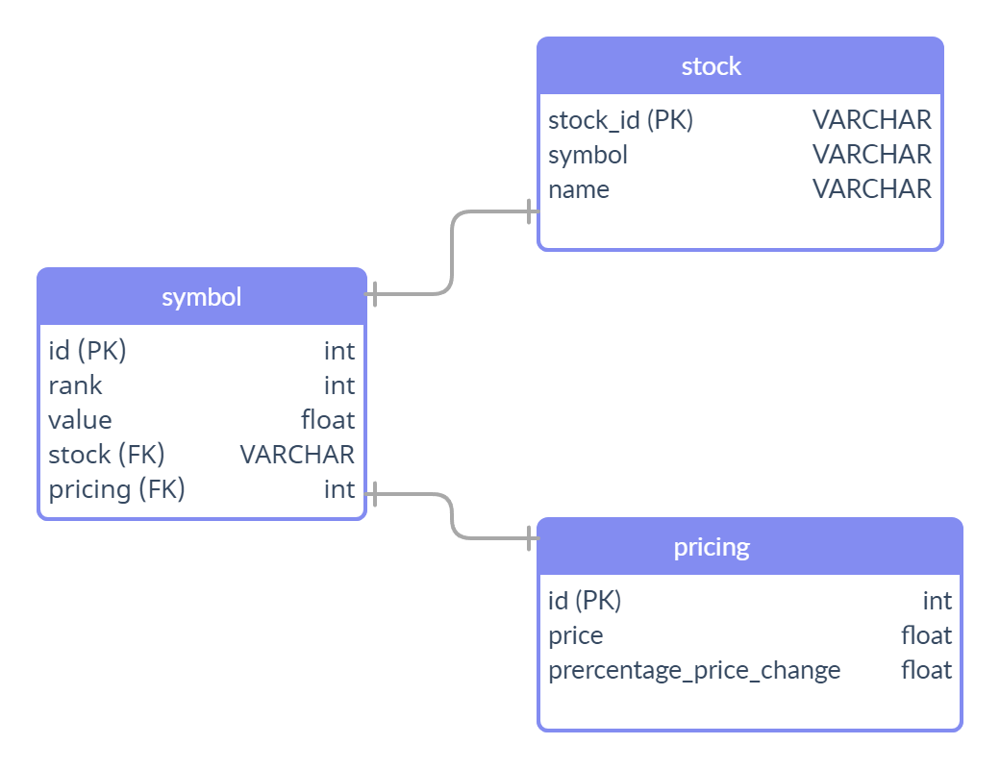
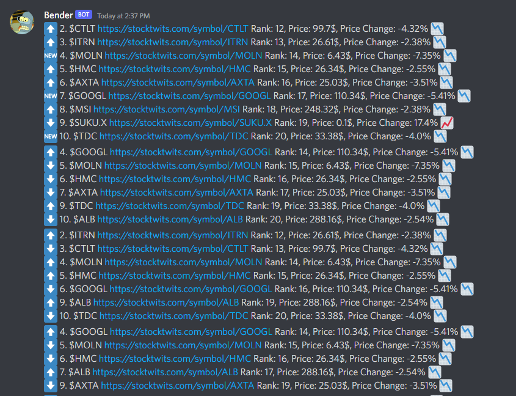
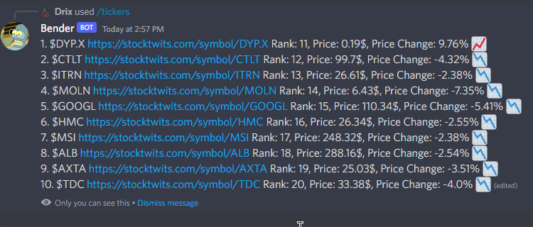

# Predi

Finding upcoming trending tickers on stocktwits

Stocktwits only shows the first 10 trending symbols on their webpage.
Through some digging we can see that they actually have an internal undocumented API that is able to retrieve more
than only the first 10 symbols you see on the webpage.

## Database



## Flow

We have a scheduled method that runs every 30 seconds scanning for the tickers that are currently trending between
ranks 11 and 20. These are not known by the public who just uses the stocktwits website.

```
@Scheduled(cron = "*/30 * * * * *")
public void scanUpcomingTickers() {
    ...
}
```

We can do that by leveraging the undocumented API for stocktwits like this:

```
curl --location --request GET 'https://api-gw-prd.stocktwits.com/rankings/api/v1/rankings?identifier=ALL&identifier-type=exchange-set&top=20&type=ts' \
--header 'Authorization: Basic SECRET_KEY'
```

This will return the top 20 trending tickers, from which we can remove the first 10 that already are present on the website as well.

What we do now is to store the tickers in the Database in order to be able to compare them later.

Everytime we run the scheduled method we compare the data we get with what we have in the database. By this we can determine the follow actions:

• A new ticker entered the top 20 ranking, so we can mark it accordingly.

• A ticker either went up or down in ranking, so we can mark it accordingly

There is a rest endpoint to gather these tickers at `/upcoming-tickers`

## Discord

For easier use I've built Bender, a Discord bot to help with visualizing the data.

The scanning happens every 30 seconds, and we publish any new data on Discord.

An example with how this looks can be seen here:



We can also get the tickers between rank 11 and 20 manually using a the slash command `/tickers`

